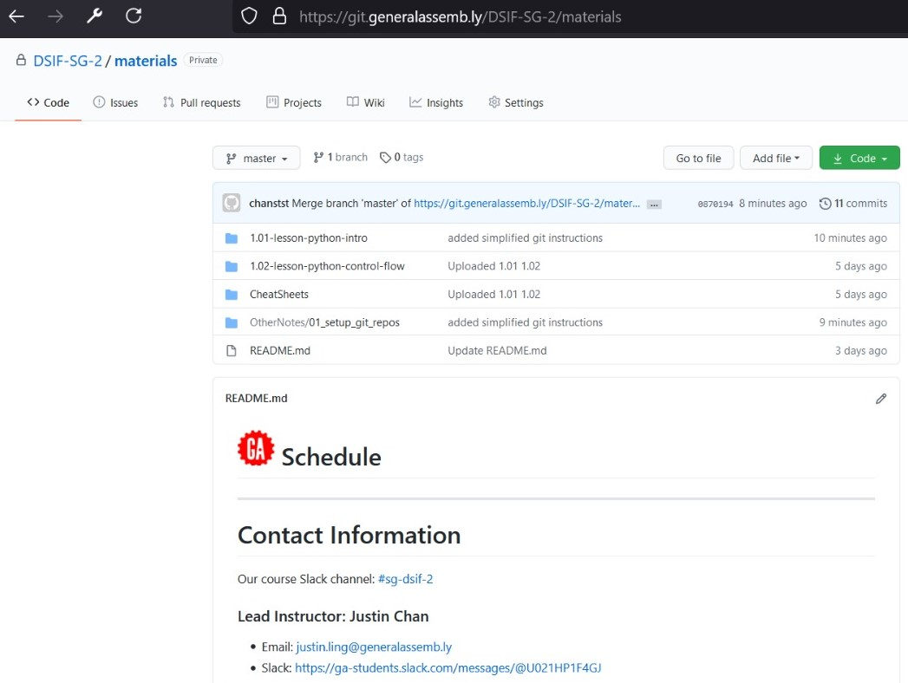

# Setup git repositories

### Objective
Set up a local folder for downloading DSIF-2 materials throughout the course



### Install Git
https://git-scm.com/downloads to get the installer


### Sign up for a Github General Assembly Enterprise Account
Go to https://git-invite.generalassemb.ly/invite

Sign up for an account (https://git.generalassemb.ly/xxxxx)

Remember the login email and password and let the TA know of your account name for granting access


### Folder at the local machine
Open a new folder at your computer designated for keeping DSIF-2 materials
Open GitBash (Windows User) or Terminal (Mac User) at the folder


### Git Clone
Type the command below
```
git clone https://git.generalassemb.ly/dsif-sg-2/materials .
```

Explanation:
- `clone` tells git to copy all the files from the URI and also setup the source link (explanation below)
- `.` at the end means clone to current directory (otherwise it will create a new folder called materials)

You will be prompted to provide the Github GA Entreprise Account
You should now be able to see 

### Git remote
Checkpoint - see if the connection with the remote repo is successful
Type the command below
```
git remote -v
```

Below is the screenshot showing the successful connection with the remote repo


### Git fetch, Git pull
Class materials will be updated regularly in future, eg solution codes updated after each class.
You will be able to download the updated materials via instructing the two commands in series
```
git fetch
git pull
```

### Make a copy to another new folder for editing
Final note: due to Git versioning control, if there are any edits in any of the files in the folder 
(for downloading), there will be errors in future downloading - your local files are different from the source file in the remote drive.
Users are recommended to copy the files to another folder, then open the copied files for editing.

### Common issues - missing credentials (Windows)
If it is the first attempt to clone the repo and the process is stuck at the point of "Cloning into...", there is a chance that authentication is not successful.

